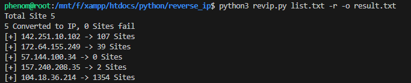

# Reverse IP tools using rapiddns
#### this tools is a reverse ip tool that returns valid domains from domain / IP
#### Requirements
`revip` just requires requests & threading lib

# Usage

```sh
python3 revip.py target.com 
```
and here's some flags:
```yaml
Usage:
  python3 revip.py target [flags]

Flags:
OUTPUT:
  -o      file to write output to
  -r      reverse the ip to domain
```
# Preview
<h1 align="left">
  </a>
  <br>
</h1>
